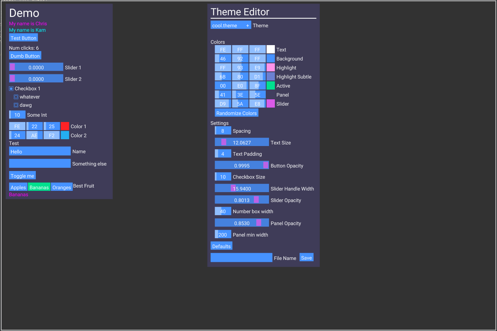
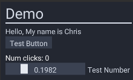

# Simple GUI

This is a simple GUI library written in C



# Example Code

```C

    #include "imgui.h"

    int num_clicks = 0;
    float v1 = 0.0;

    void draw()
    {
        imgui_begin_panel("Demo", 10,10);

            imgui_text("Hello, My name is %s", "Chris");

            if(imgui_button("Test Button"))
                num_clicks++;

            imgui_text_colored(0xFFFFFFFF, "Num clicks: %d", num_clicks);
            imgui_slider_float("Test Number", 0.0, 1.0, &v1);

        imgui_end();
    }
```

Running the code will show this:



# Supported Features

- Text
- Buttons
- Image Buttons
- Toggle Buttons
- Checkboxes
- Color Picker
- Number Sliders
- Number Boxes
- Text Boxes
- Dropdown Selects
- Tooltips

# How to run

```bash

# make sure you have gcc, glfw
./run.sh

```
